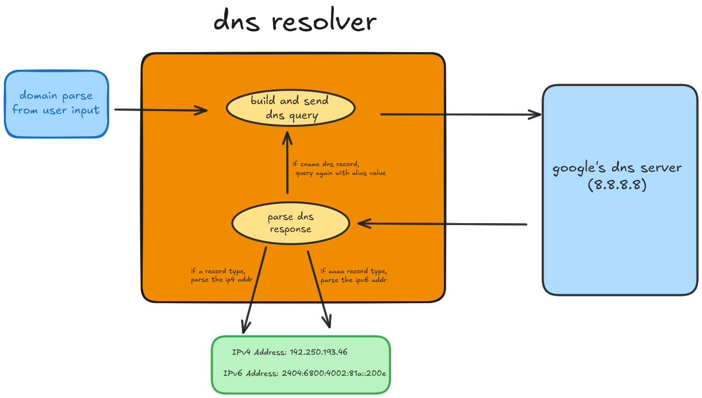

# DNS Resolver

A lightweight DNS resolver implementation in C that performs IPv4 (A) and IPv6 (AAAA) record lookups

## Overview

This DNS resolver implements basic DNS query functionality by:
- Building and sending DNS queries to a DNS server (Google DNS - 8.8.8.8)
- Parsing DNS responses including A, AAAA, and CNAME records
- Supporting both IPv4 and IPv6 address resolution

## Architecture


## Setup Guide

### Prerequisites
- GCC compiler
- Make build system
- Linux/Unix environment (for socket programming)

### Building the Project

1. Clone the repository

```bash
git clone <repository-url>
cd dns-resolver
```

2. Build the project

```bash
make
```

3. Run the resolver

```bash
./bin/dns_resolver <domain-name>
```

## Technical Details

### Implementation Notes
- Uses UDP for DNS queries (port 53)
- Maximum packet size: 512 bytes (standard DNS)
- Supports DNS name compression
- Handles multiple answers per query

## Usage Example

```bash
./bin/dns_resolver www.github.com
```

# Example output:

```bash
Response ID: 1234
Answer Count: 2
IPv4 Address: 140.82.121.4
IPv6 Address: 2a00:1450:4009:822::2004
```
